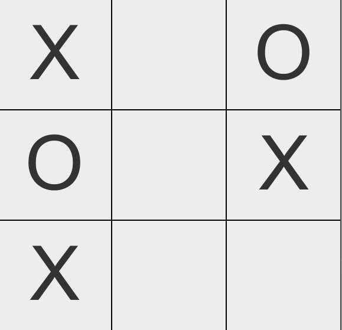

<h1 align="center">Tic Tac Toe AI</h1>

    

## About Tic Tac Toe

     

Tic-Tac-Toe is a small project that uses the minimax algorithm to prove that two AI playing tic-tac-toe will result in never-ending chaos. Right now, only the AI play each other, but only a small change is required to allow for human players.

## Dependencies

This program uses my Theta library. The JAR file is located [here](https://github.com/JoshuaCrotts/Theta/blob/master/lib/Theta.jar).

## Rebuilding Tic Tac Toe

Clone the repository to your computer and compile via your favorite IDE or terminal environment. Make sure to add the Theta JAR to the build path. Use W or S to increase or decrease the speed of the simulation respectively.

## Reporting Bugs

See the Issues Tab.

## Version History
The **master** branch encompasses all changes.